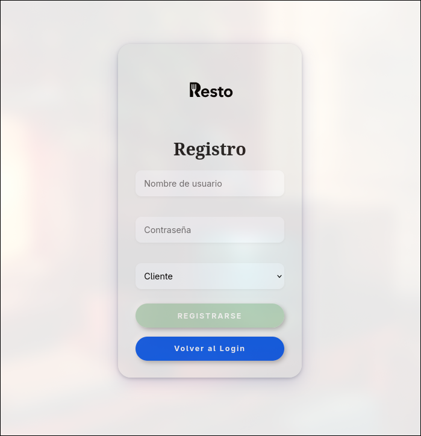
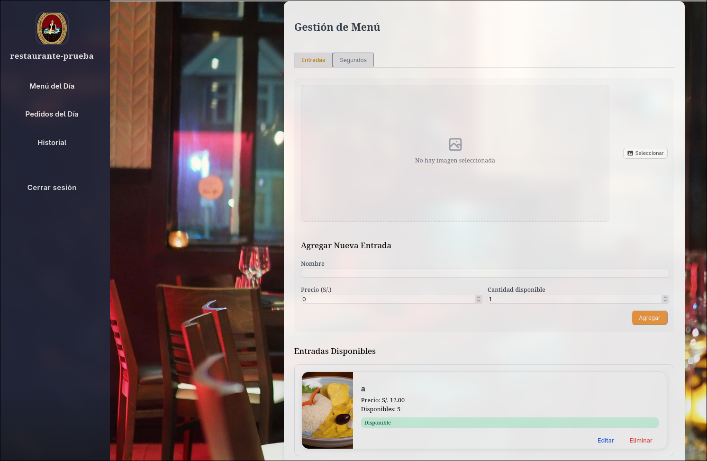
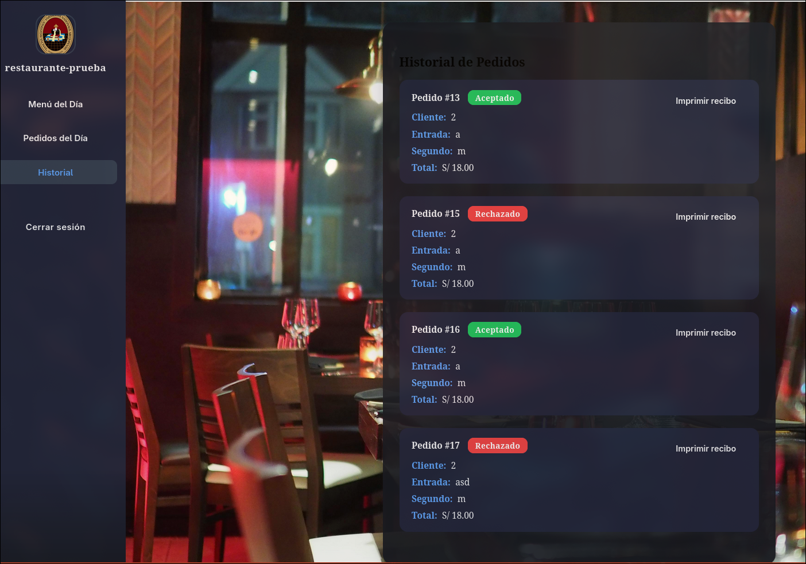
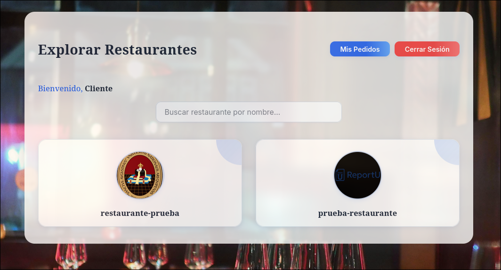
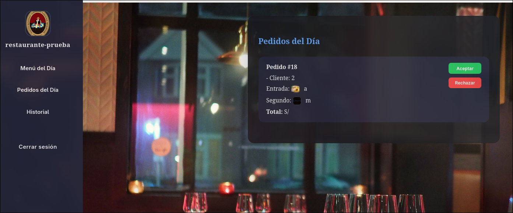

# ProyectoFinal-PW2

## Introducción

Este informe presenta el desarrollo y la arquitectura de **ProyectoFinal-PW2**, una plataforma web diseñada para la gestión de restaurantes y pedidos en línea. El sistema utiliza Django como backend y Angular como frontend, permitiendo la interacción eficiente y segura entre clientes y restaurantes.  
A lo largo del documento se describen las configuraciones principales, la estructura de datos, los flujos de autenticación, la gestión de menús y pedidos, así como la organización de los componentes clave tanto en el backend como en el frontend.

## Objetivos

- Integrar los conocimientos adquiridos en el curso de Programación Web 2.
- Fomentar el trabajo en equipo y la colaboración en el desarrollo de software.
- Desarrollar una aplicación web real que resuelva una necesidad concreta de una empresa, aplicando buenas prácticas de desarrollo backend y frontend.


## Descripción general

El proyecto se desarrolló para una empresa ficticia del rubro gastronómico que necesitaba digitalizar la gestión de sus restaurantes y pedidos en línea. El problema principal era la falta de un sistema centralizado para que los clientes pudieran explorar restaurantes, ver menús diarios y realizar pedidos, y para que los restaurantes pudieran gestionar sus menús y pedidos de manera eficiente.  
La solución propuesta fue una plataforma web compuesta por un backend en Django y un frontend en Angular, que permite la interacción fluida y segura entre clientes y restaurantes, automatizando los procesos de registro, autenticación, gestión de menús, pedidos y seguimiento.


## Requerimientos funcionales

- Registro y autenticación de usuarios (clientes y restaurantes).
- Gestión de perfiles de usuario y restaurante.
- Creación y edición de menús diarios por parte de los restaurantes.
- Visualización de menús y exploración de restaurantes por parte de los clientes.
- Realización de pedidos por los clientes y gestión de pedidos por los restaurantes (aceptar/rechazar).
- Historial de pedidos tanto para clientes como para restaurantes.
- Generación e impresión de recibos en PDF.
- Interfaz responsiva y amigable, protegida mediante autenticación JWT.

## Estructura Django

backend/  
 settings.py  
 urls.py  

users/  
 models.py  
 serializers.py  
 admin.py  

restaurants/  
 models.py  
 serializers.py  
 views.py  
 urls.py  
 admin.py  


## Estructura Angular

src/  
 app/  
  auth/  
  restaurants/  
   menu-dia/  
   pedidos-dia/  
   historial/  
  clientes/  
   explorador-restaurantes/  
   menu-restaurante/  
   confirmacion-pedido/  
   mis-pedidos/  
  services/

# Django

## Dependencias

Para el correcto funcionamiento del backend, se instalaron las siguientes dependencias principales:

```bash
pip install Pillow  
pip install django-cors-headers  
pip install djangorestframework-simplejwt  
pip install djoser  
```

- **Pillow:** Permite el manejo de imágenes en los modelos (por ejemplo, para fotos de platos o restaurantes).
- **django-cors-headers:** Habilita CORS para permitir peticiones desde el frontend Angular.
- **djangorestframework-simplejwt:** Proporciona autenticación basada en JWT para la API.
- **djoser:** Provee endpoints listos para registro, login y gestión de usuarios.


## Configuraciones principales

A continuación se resumen las configuraciones clave del archivo `settings.py`:

### Importaciones y rutas

```python
from datetime import timedelta
from pathlib import Path
import os
```
- Se importan módulos para manejar rutas de archivos y definir tiempos de expiración (por ejemplo, para JWT).

### Rutas de archivos estáticos y media

```python
BASE_DIR = Path(__file__).resolve().parent.parent
MEDIA_URL = '/media/'
MEDIA_ROOT = os.path.join(BASE_DIR, 'media')
STATIC_URL = 'static/'
```
- `BASE_DIR` define la ruta base del proyecto.
- `MEDIA_URL` y `MEDIA_ROOT` configuran dónde se almacenan y cómo se acceden los archivos subidos por los usuarios.
- `STATIC_URL` define la ruta para los archivos estáticos (CSS, JS, imágenes).

### Seguridad

```python
SECRET_KEY = '...'
DEBUG = True
ALLOWED_HOSTS = []
```
- `SECRET_KEY` es la clave secreta de Django, usada para seguridad interna.
- `DEBUG` activa el modo de desarrollo (debe ser False en producción).
- `ALLOWED_HOSTS` define los dominios permitidos para acceder a la app.

### Configuración de JWT (JSON Web Token)

```python
SIMPLE_JWT = {
    'ACCESS_TOKEN_LIFETIME': timedelta(hours=1),  
    'REFRESH_TOKEN_LIFETIME': timedelta(days=1),
}
```
- Se usa la librería Simple JWT para autenticación basada en tokens.
- Define que el token de acceso dura 1 hora y el de refresco 1 día.

### Aplicaciones instaladas

```python
INSTALLED_APPS = [
    'django.contrib.admin',
    'django.contrib.auth',
    'rest_framework',
    'rest_framework.authtoken',
    'djoser',
    'corsheaders',
    'users',
    'restaurants',
]
```
- Incluye apps de Django (admin, auth, etc.).
- `rest_framework`: Framework para crear APIs REST.
- `rest_framework.authtoken`: Autenticación por token.
- `djoser`: Endpoints listos para autenticación y gestión de usuarios.
- `corsheaders`: Permite peticiones desde otros dominios (CORS).
- `users` y `restaurants`: Apps propias del proyecto.

### Modelo de usuario personalizado

```python
AUTH_USER_MODEL = 'users.User'
```
- Se usa un modelo de usuario propio (`User` en la app `users`) para poder agregar campos personalizados (como tipo de usuario).

### Middleware

```python
MIDDLEWARE = [
    'corsheaders.middleware.CorsMiddleware',
    # ...
]
```
- Lista de middlewares que procesan cada petición/respuesta.
- `CorsMiddleware` permite el uso de CORS para el frontend Angular.

### CORS

```python
CORS_ALLOWED_ORIGINS = [
    "http://localhost:4200",
]
```
- Permite que el frontend Angular (en el puerto 4200) haga peticiones a la API Django.

### Base de datos

```python
DATABASES = {
    'default': {
        'ENGINE': 'django.db.backends.sqlite3',
        'NAME': BASE_DIR / 'db.sqlite3',
    }
}
```
- Usa SQLite como base de datos por defecto (ideal para desarrollo).

### Internacionalización

```python
LANGUAGE_CODE = 'es-pe'
TIME_ZONE = 'America/Lima'
USE_I18N = True
USE_TZ = True
```
- Configura el idioma y la zona horaria para Perú.

### Configuración de DRF y Djoser

```python
REST_FRAMEWORK = {
    'DEFAULT_AUTHENTICATION_CLASSES': (
        'rest_framework_simplejwt.authentication.JWTAuthentication',
    ),
}
DJOSER = {
    'SERIALIZERS': {
        'user_create': 'users.serializers.UserCreateSerializer',
        'user': 'users.serializers.UserSerializer',
        'current_user': 'users.serializers.UserSerializer',
    }
}
```
- `REST_FRAMEWORK`: Usa JWT como método de autenticación por defecto.
- `DJOSER`: Define los serializadores personalizados para la gestión de usuarios.

### Otros

```python
DEFAULT_AUTO_FIELD = 'django.db.models.BigAutoField'
```
- Define el tipo de campo auto-incremental por defecto para los modelos.


## Modelos y apps

### Apps creadas

- **users:**  
  Gestiona los usuarios del sistema, permitiendo distinguir entre clientes y restaurantes mediante un campo personalizado.
- **restaurants:**  
  Gestiona toda la lógica relacionada a restaurantes, menús, platos y pedidos.

### Modelo de Usuario Personalizado

```python
class User(AbstractUser):
    TIPO_USUARIO = (
        ('cliente', 'Cliente'),
        ('restaurante', 'Restaurante'),
    )
    tipo = models.CharField(max_length=15, choices=TIPO_USUARIO, default='cliente')
```
- Hereda de `AbstractUser` para aprovechar la autenticación de Django.
- Agrega el campo `tipo` para diferenciar entre usuarios cliente y restaurante.

### Modelos de la app `restaurants`

#### Restaurant

```python
class Restaurant(models.Model):
    user = models.OneToOneField(User, on_delete=models.CASCADE, limit_choices_to={'tipo': 'restaurante'})
    nombre = models.CharField(max_length=100)
    imagen = models.ImageField(upload_to='restaurantes/', blank=True, null=True)
```
- Relaciona un usuario tipo restaurante con su información específica (nombre, imagen).

#### Menu

```python
class Menu(models.Model):
    restaurante = models.ForeignKey(Restaurant, on_delete=models.CASCADE)
    fecha = models.DateField()
```
- Representa el menú del día de un restaurante.

#### Entrada y Segundo

```python
class Entrada(models.Model):
    nombre = models.CharField(max_length=100)
    cantidad = models.PositiveIntegerField(default=0)
    precio = models.DecimalField(max_digits=6, decimal_places=2)
    imagen = models.ImageField(upload_to='entradas/', blank=True, null=True)
    menu = models.ForeignKey('Menu', related_name='entradas', on_delete=models.CASCADE)
```
- **Entrada** y **Segundo** representan los platos disponibles en el menú del día, cada uno con nombre, cantidad, precio, imagen y relación al menú.

#### Pedido

```python
class Pedido(models.Model):
    cliente = models.ForeignKey(User, on_delete=models.CASCADE, limit_choices_to={'tipo': 'cliente'})
    menu = models.ForeignKey(Menu, on_delete=models.CASCADE)
    entrada = models.ForeignKey(Entrada, on_delete=models.CASCADE)
    segundo = models.ForeignKey(Segundo, on_delete=models.CASCADE)
    estado = models.CharField(max_length=20, choices=ESTADOS, default='pendiente')
    fecha = models.DateTimeField(auto_now_add=True)
```
- Representa un pedido realizado por un cliente, con referencias al menú, entrada y segundo elegidos, estado del pedido y fecha.


## Serializers

Los serializers permiten convertir los modelos de la base de datos a formatos como JSON para enviar datos al frontend, y también validar y transformar datos recibidos desde el frontend antes de guardarlos en la base de datos.

### Serializers de usuarios

- **UserCreateSerializer**  
  Extiende el serializer de Djoser para permitir el registro de usuarios tipo restaurante con campos extra (`nombre_restaurante`, `imagen_restaurante`).  
  Si el usuario es restaurante, crea automáticamente un objeto `Restaurant` relacionado.

- **UserSerializer**  
  Serializa los datos básicos del usuario (`id`, `username`, `tipo`).

### Serializers de restaurantes y pedidos

- **RestaurantListSerializer / RestaurantDetailSerializer**  
  Permiten listar y mostrar detalles de restaurantes, incluyendo la imagen.

- **MenuCreateSerializer, EntradaCreateSerializer, SegundoCreateSerializer**  
  Permiten crear menús, entradas y segundos (platos) con sus campos principales.

- **MenuReadSerializer**  
  Permite mostrar un menú junto con sus entradas y segundos relacionados.

- **PedidoCreateSerializer**  
  Permite crear pedidos, validando que los platos seleccionados pertenezcan al menú elegido.

- **PedidoReadSerializer**  
  Permite mostrar los pedidos con detalles de los platos (entrada y segundo).

- **PedidoEstadoUpdateSerializer**  
  Permite actualizar solo el estado de un pedido (aceptado, rechazado, etc.).

- **RestaurantUpdateSerializer**  
  Permite editar los datos de un restaurante.

- **PedidoSerializer**  
  Serializador general para mostrar todos los campos de un pedido.

**Resumen:**  
Los serializers permiten controlar cómo se envían y reciben los datos entre el frontend y el backend, asegurando que la información sea válida y esté bien estructurada para cada operación del sistema (registro, menús, pedidos, etc.).


## Views

En la app `users` no se implementan vistas personalizadas, ya que la autenticación y gestión de usuarios se maneja con Djoser y Django REST Framework, que proveen endpoints listos para registro, login, recuperación de contraseña y obtención del usuario actual.  
Los serializers personalizados permiten adaptar el registro para usuarios tipo restaurante sin necesidad de crear views propias.

En la app `restaurants` sí se crean vistas personalizadas porque la lógica de negocio es más específica. Se utilizan principalmente **ViewSets** y **Generic Views** para:

- CRUD de restaurantes, menús, entradas y segundos (platos)
- Obtener menús por restaurante y por fecha
- Crear y listar pedidos, actualizar su estado
- Listar historial de pedidos y pedidos pendientes
- Actualizar perfil de restaurante

**Ejemplo de ViewSet para restaurantes:**
```python
class RestaurantViewSet(viewsets.ModelViewSet):
    queryset = Restaurant.objects.all()
    serializer_class = RestaurantListSerializer
    permission_classes = [permissions.IsAuthenticatedOrReadOnly]
    filter_backends = [filters.SearchFilter]
    search_fields = ['nombre']
```

**Ejemplo de vista personalizada para obtener el menú del día:**
```python
class MenuHoyByRestaurantView(generics.RetrieveAPIView):
    serializer_class = MenuReadSerializer
    permission_classes = [permissions.AllowAny]

    def get_object(self):
        restaurante_id = self.kwargs['restaurante_id']
        hoy = date.today()
        try:
            return Menu.objects.get(restaurante__id=restaurante_id, fecha=hoy)
        except Menu.DoesNotExist:
            restaurante = Restaurant.objects.get(id=restaurante_id)
            menu = Menu.objects.create(restaurante=restaurante, fecha=hoy)
            return menu
```

**Resumen:**  
- `users`: No tiene views propias porque Djoser y DRF ya proveen todos los endpoints necesarios para usuarios.
- `restaurants`: Tiene views personalizadas para toda la lógica de restaurantes, menús, platos y pedidos, usando ViewSets y Generic Views para facilitar el desarrollo y mantener el código organizado.


## URLs y Admin

### URLs principales

Archivo principal de URLs (`backend/urls.py`):

```python
from django.conf import settings
from django.conf.urls.static import static
from django.contrib import admin
from django.urls import path, include

urlpatterns = [
    path('admin/', admin.site.urls),
    path('api/restaurants/', include('restaurants.urls')),
    path('auth/', include('djoser.urls')),
    path('auth/', include('djoser.urls.jwt')),
]

if settings.DEBUG:
    urlpatterns += static(settings.MEDIA_URL, document_root=settings.MEDIA_ROOT)
```
- `admin/`: Acceso al panel de administración de Django.
- `api/restaurants/`: Todas las rutas de la app `restaurants` (menús, platos, pedidos, etc.).
- `auth/`: Endpoints de autenticación y gestión de usuarios proporcionados por Djoser.

URLs de la app `restaurants` (`restaurants/urls.py`):

```python
from django.urls import path, include
from rest_framework.routers import DefaultRouter
from .views import (
    RestaurantViewSet, MenuViewSet, EntradaViewSet, SegundoViewSet,
    MenusByRestaurantView, PedidoCreateView, PedidosRecibidosView,
    PedidoEstadoUpdateView, RestaurantUpdateView, MisPedidosView,
    RestaurantDetailView, RestaurantByUserView, MenuHoyByRestaurantView,
    PedidoDetailView, PedidosPendientesRestauranteView, PedidosHistorialRestauranteView
)

router = DefaultRouter()
router.register(r'restaurantes', RestaurantViewSet)
router.register(r'menus', MenuViewSet)
router.register(r'entradas', EntradaViewSet)
router.register(r'segundos', SegundoViewSet)

urlpatterns = [
    path('', include(router.urls)),
    path('restaurantes/id/<int:user_id>/', RestaurantByUserView.as_view(), name='restaurant-by-user'),
    path('restaurantes/<int:pk>/', RestaurantDetailView.as_view(), name='restaurant-detail'),
    path('restaurante/<int:restaurante_id>/menus/', MenusByRestaurantView.as_view(), name='menus-by-restaurant'),
    path('restaurante/<int:restaurante_id>/menu-hoy/', MenuHoyByRestaurantView.as_view(), name='menu-hoy-by-restaurant'),
    path('pedidos/', PedidoCreateView.as_view(), name='pedido-create'),
    path('pedidos-recibidos/', PedidosRecibidosView.as_view(), name='pedidos-recibidos'),
    path('pedidos/<int:pk>/estado/', PedidoEstadoUpdateView.as_view(), name='pedido-estado-update'),
    path('mi-restaurante/editar/', RestaurantUpdateView.as_view(), name='restaurant-update'),
    path('mis-pedidos/', MisPedidosView.as_view(), name='mis-pedidos'),
    path('pedidos/<int:pk>/', PedidoDetailView.as_view(), name='pedido-detail'),
    path('restaurante/<int:restaurante_id>/pedidos-pendientes/', PedidosPendientesRestauranteView.as_view(), name='pedidos-pendientes-restaurante'),
    path('restaurante/<int:restaurante_id>/historial-pedidos/', PedidosHistorialRestauranteView.as_view(), name='historial-pedidos-restaurante'),
]
```
- Usa un router para CRUD automático de restaurantes, menús, entradas y segundos.
- Define rutas personalizadas para obtener menús por restaurante, menú del día, crear y listar pedidos, actualizar estado, historial, etc.

### Admin

Admin de la app `restaurants` (`restaurants/admin.py`):

```python
from django.contrib import admin
from .models import Restaurant, Menu, Entrada, Segundo, Pedido

admin.site.register(Restaurant)
admin.site.register(Menu)
admin.site.register(Entrada)
admin.site.register(Segundo)
admin.site.register(Pedido)
```
- Permite administrar desde el panel de Django todos los modelos relacionados a restaurantes, menús, platos y pedidos.

Admin de la app `users` (`users/admin.py`):

```python
from django.contrib import admin
from .models import User

admin.site.register(User)
```
- Permite administrar los usuarios personalizados desde el panel de Django.

**Resumen:**  
Las URLs principales conectan el admin, la API de restaurantes y la autenticación de usuarios.  
El admin de Django permite gestionar todos los modelos del sistema de forma visual y sencilla.


# Angular

## Dependencias

Para el frontend se instalaron dependencias como:

```bash
npm install jspdf jspdf-invoice-template
```
Estas librerías permiten generar e imprimir recibos en PDF desde la aplicación.


## Registro de usuario

El formulario permite registrar usuarios como cliente o restaurante. Si es restaurante, se solicitan datos adicionales como nombre e imagen. Los datos se envían al backend mediante un servicio Angular que comunica con el endpoint `/auth/users/` de Django.

**Ejemplo de envío de datos desde el componente:**
```typescript
onSubmit() {
  const formData = new FormData();
  formData.append('username', this.username);
  formData.append('password', this.password);
  formData.append('tipo', this.tipo);
  if (this.tipo === 'restaurante') {
    formData.append('nombre_restaurante', this.nombreRestaurante);
    if (this.imagenRestaurante) {
      formData.append('imagen_restaurante', this.imagenRestaurante);
    }
  }
  this.auth.register(formData).subscribe({
    next: () => { this.success = 'Registro exitoso.'; },
    error: () => { this.error = 'Error en el registro.'; }
  });
}
```
El backend valida y crea el usuario, diferenciando entre cliente y restaurante.


## Login

El usuario ingresa su nombre y contraseña. Si las credenciales son correctas, el backend responde con un token JWT que se guarda en el navegador. El token permite acceder a rutas protegidas y obtener los datos del usuario. Según el tipo de usuario, se redirige a la vista correspondiente.

**Ejemplo de login y redirección:**
```typescript
onSubmit() {
  this.auth.login({ username: this.username, password: this.password }).subscribe({
    next: (res) => {
      this.auth.saveToken(res.access);
      this.auth.getCurrentUser().subscribe({
        next: (user) => {
          if (user.tipo === 'restaurante') {
            this.router.navigate(['/restaurants/menu-dia']);
          } else {
            this.router.navigate(['/clientes/explorador-restaurantes']);
          }
        }
      });
    },
    error: () => {
      this.error = 'Usuario o contraseña incorrectos';
    }
  });
}
```


## Menú del Día

Permite al restaurante gestionar el menú diario: agregar, editar o eliminar entradas y segundos. Los cambios se envían al backend y se reflejan en la base de datos. Solo usuarios tipo restaurante pueden acceder a esta sección.

**Ejemplo de agregar una entrada:**
```typescript
agregarEntrada() {
  const formData = new FormData();
  formData.append('nombre', this.nuevaEntrada.nombre);
  formData.append('precio', this.nuevaEntrada.precio);
  formData.append('cantidad', this.nuevaEntrada.cantidad);
  formData.append('menu', this.menuId);
  if (this.nuevaEntrada.imagen) {
    formData.append('imagen', this.nuevaEntrada.imagen);
  }
  this.restaurantService.addEntrada(formData).subscribe(() => this.cargarEntradas());
}
```


## Pedidos del Día

El restaurante visualiza los pedidos pendientes del día, con información del cliente y los platos solicitados. Puede aceptar o rechazar pedidos, y el estado se actualiza tanto en el backend como en la interfaz.

**Ejemplo de aceptar/rechazar pedido:**
```typescript
aceptarPedido(pedidoId: number) {
  this.restaurantService.updateEstadoPedido(pedidoId, 'aceptado').subscribe(() => {
    this.pedidos = this.pedidos.filter(p => p.id !== pedidoId);
  });
}
rechazarPedido(pedidoId: number) {
  this.restaurantService.updateEstadoPedido(pedidoId, 'rechazado').subscribe(() => {
    this.pedidos = this.pedidos.filter(p => p.id !== pedidoId);
  });
}
```


## Historial de Pedidos

Muestra al restaurante el historial de todos los pedidos (aceptados, rechazados, entregados, etc.). Permite filtrar por fecha o estado y generar recibos en PDF para cada pedido.

**Ejemplo de impresión de recibo:**
```typescript
imprimirRecibo(pedido: any) {
  // Prepara los datos y llama a jsPDFInvoiceTemplate(props)
}
```


## Explorador de Restaurantes

Permite a los clientes buscar y explorar restaurantes disponibles. Se puede filtrar por nombre y seleccionar un restaurante para ver su menú del día.

**Ejemplo de filtrado:**
```typescript
filtrarRestaurantes() {
  const termino = this.busqueda.trim().toLowerCase();
  this.restaurantesFiltrados = this.restaurantes.filter(r =>
    r.nombre.toLowerCase().includes(termino)
  );
}
```


## Menú del Restaurante

El cliente visualiza el menú del día de un restaurante seleccionado, elige una entrada y un segundo, y realiza el pedido. El total se calcula automáticamente y el pedido se envía al backend.

**Ejemplo de realizar pedido:**
```typescript
realizarPedido() {
  if (!this.entradaSeleccionadaId || !this.segundoSeleccionadoId) {
    alert('Debes seleccionar una entrada y un segundo.');
    return;
  }
  const data = {
    menu: this.menuDelDia.id,
    entrada: this.entradaSeleccionadaId,
    segundo: this.segundoSeleccionadoId
  };
  this.clienteService.crearPedido(data).subscribe({
    next: (pedido) => {
      this.router.navigate(['/clientes/confirmacion-pedido', pedido.id]);
    },
    error: () => {
      alert('Error al realizar el pedido.');
    }
  });
}
```


## Confirmación de Pedido

Después de realizar un pedido, el cliente ve el estado del mismo (pendiente, aceptado o rechazado). La aplicación consulta periódicamente el backend hasta que el pedido cambia de estado y luego redirige automáticamente.

**Ejemplo de polling para estado del pedido:**
```typescript
ngOnInit() {
  this.pedidoId = Number(this.route.snapshot.paramMap.get('id'));
  this.verificarEstadoPedido();
  this.pollingInterval = setInterval(() => this.verificarEstadoPedido(), 2000);
}
verificarEstadoPedido() {
  this.clienteService.getPedidoDetalle(this.pedidoId).subscribe({
    next: pedido => {
      if (pedido.estado === 'aceptado' || pedido.estado === 'rechazado') {
        clearInterval(this.pollingInterval);
        setTimeout(() => this.router.navigate(['/clientes/mis-pedidos']), 5000);
      }
    }
  });
}
```


## Mis Pedidos

El cliente puede ver el historial y estado de todos sus pedidos realizados, con detalles como fecha, restaurante, platos y total. Permite hacer seguimiento y navegar fácilmente dentro de la app.

**Ejemplo de carga de pedidos:**
```typescript
cargarMisPedidos(userId: number) {
  this.clienteService.getPedidosPorCliente(userId).subscribe({
    next: pedidos => {
      this.pedidos = pedidos;
    },
    error: () => {
      this.pedidos = [];
    }
  });
}
```
# Resultados

A continuación se muestran algunos resultados visuales del funcionamiento de la plataforma:


### Página de registro de usuario


*Formulario para registrar clientes o restaurantes, incluyendo campos adicionales para restaurantes.*


### Vista del menú del día (restaurante)


*Gestión de entradas y segundos por parte del restaurante.*


### Pedidos del día (restaurante)


*Listado de pedidos pendientes, con opciones para aceptar o rechazar.*


### Explorador de restaurantes (cliente)


*Panel donde el cliente puede buscar y seleccionar restaurantes.*


### Confirmación de pedido (cliente)


*Estado del pedido tras ser realizado, con actualización automática.*


## Conclusiones

El desarrollo de este proyecto permitió aplicar de manera práctica los conocimientos adquiridos en el curso, integrando tecnologías modernas para construir una solución web robusta y escalable. El trabajo en equipo y la colaboración fueron fundamentales para lograr los objetivos propuestos.

## Evaluación del Trabajo en Equipo

| Integrante           | Responsabilidad | Proactividad | Aporte al grupo | Calificó a sus compañeros | Nota Individual (40%) | Nota Grupal (60%) | Nota Final |
|----------------------|----------------|--------------|-----------------|---------------------------|----------------------|-------------------|------------|
| Quispe Mamani Jose Gabriel  |      /5        |     /5       |      /5         |        Sí/No              |        /20           |       /20         |   /20      |
| Riveros Vilca Alberth Edwar  |      /5        |     /5       |      /5         |        Sí/No              |        /20           |       /20         |   /20      |
| Estefanero Palma Rodrigo  |      /5        |     /5       |      /5         |        Sí/No              |        /20           |       /20         |   /20      |
| Nombre Integrante 4  |      /5        |     /5       |      /5         |        Sí/No              |        /20           |       /20         |   /20      |


## Anexos

- [Repositorio Backend y Frontend (Django y Angular)](https://github.com/UNSA3/py-final-2025-pf25_a5)
- [Demo en la nube](URL_DEMO)
- [Videos de funcionamiento](https://drive.google.com/drive/folders/1UTxUJW-cJ_SZnRGOgV1po5QrPJQkl98K?usp=sharing)